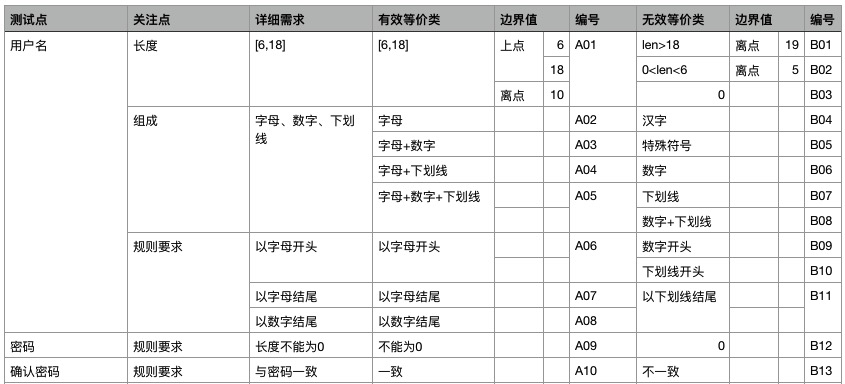
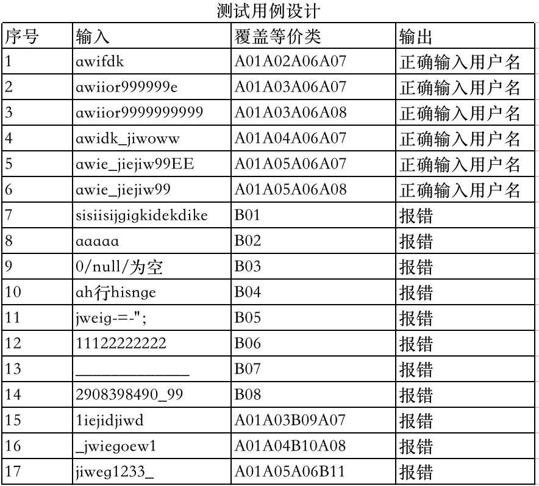
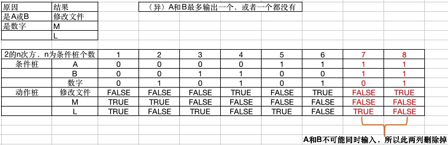
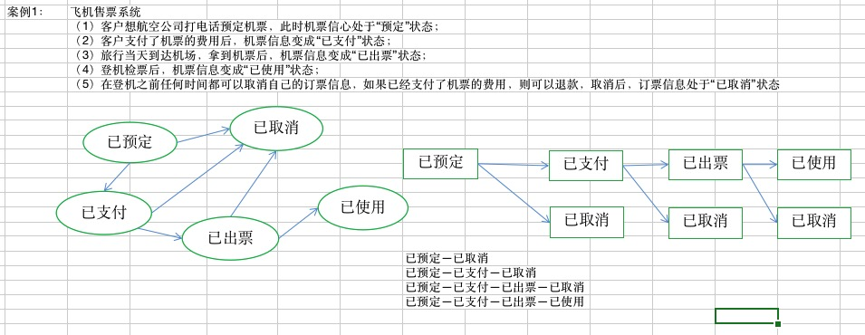

# 测试用例设计方法

## 测试用例格式十大特点

1. 用例编号
2. 测试项
3. 测试标题
4. 用例属性
5. 重要级别：高中低
6. 预置条件
7. 测试输入
8. 操作步骤
9. 预期结果
10. 实际结果

## 等价类划分法

1. 等价类定义

<table border="1">
  <tr>
    <td rowspan="3">等价定义</td>
    <td>具有相同属性或者方法的事物集合</td>
  </tr>
  <tr>
    <td>这个集合中某个体所表现的特征与其他个体完全一致</td>
  </tr>
  <tr>
    <td>对于某个被测对象的测试输入而言，某个个体能够被接受或被拒绝，则该个体在集合中的任意个体都应被接受或被拒绝</td>
  </tr>
</table>

2. 等价类划分

<table border="1">
  <tr>
    <td rowspan="3">等价类划分</td>
    <td>有效等价类</td>
    <td>针对被测对象而言，合理的、有意义的、系统接受的输入</td>
    <td>如：用户名长度在[6,18]</td>
  </tr>
  <tr>
    <td>无效等价类</td>
    <td>针对被测对象而言，不合理的、无意义的、系统不能接受的输入</td>
    <td>如：用户名长度大于18位，或者小于6位</td>
  </tr>
</table>

3. 等价类划分规则

<table border="1">
  <tr>
    <td rowspan="7">等价类划分规则</td>
    <td rowspan="2">如果需求规定了输入域的取值个数或确定了某个范围时，则可确定一个有效等价类及两个无效等价类</td>
    <td>有效等价类</td>
    <td>如：用户名长度在[6,18]</td>
  </tr>
  <tr>
    <td>无效等价类</td>
    <td>如：用户名长度大于18位，或者小于6位</td>
  </tr>
  <tr>
    <td rowspan="2">如果需求规定了某个输入域的集合，或者必须如何的情况下，可确定一个有效等价类及一个无效等价类</td>
    <td>有效等价类</td>
    <td>如：以字母开头</td>
  </tr>
  <tr>
    <td>无效等价类</td>
    <td>如：非字母开头</td>
  </tr>
  <tr>
    <td colspan="3">如果需求规定了某个输入域是真假值，可确定一个有效等价类和一个无效等价类</td>
  </tr>
  <tr>
    <td>如果需求规定了某个输入域是是一组值，则可确定若干个有效等价类及一个无效等价类</td>
    <td>XX商场</td>
    <td>钻石会员、金牌会员、铜牌会员和普通注册会员</td>
  </tr>
  <tr>
    <td>如果需求规定必须准守某种规则时，可确定一个有效等价类及若干个从不同角度违反规则的无效等价类</td>
    <td>以字母开头</td>
    <td>有效等价类：以字母开头；无效等价类：以数字、汉字、特殊字符开头</td>
  </tr>
</table>

4. 进行等价类用例设计

<table border="1">
  <tr>
    <td rowspan="3">进行用例设计</td>
    <td>根据需求，划分有效及无效等价类，有效等价类统一编码，无效等价类统一编码</td>
  </tr>
  <tr>
    <td>设计一个新的测试用例，使其尽可能的覆盖所有尚未覆盖的有效等价类，直到所有有效等价类都被覆盖</td>
  </tr>
  <tr>
    <td>设计一个新的测试用户，使其仅覆盖一个无效等价类，直到所有无效等价类都被覆盖</td>
  </tr>
</table>

5. 案例加以说明

:::tip 用户创建账号
用户名：[6~18个字符，包括字母、数字、下划线][字母开头，字母和数字结尾，不区分大小写]

密码：

确认密码：
:::

## 边界值分析法

针对功能说明中的输入输出域，进行边界值和极限值的设计和测试。

1. 边界值的三点

例：用户名长度为6~18位

<table border="1">
  <tr>
    <td rowspan="3">边界值三点</td>
    <td>上点</td>
    <td>边界上的点</td>
    <td>6</td>
    <td>8</td>
  </tr>
  <tr>
    <td rowspan="2">离点</td>
    <td>离上边最近的点</td>
    <td>5</td>
    <td>19</td>
  </tr>
  <tr>
    <td>根据上点的精度确定</td>
    <td></td>
    <td></td>
  </tr>
  <tr>
    <td>内点</td>
    <td>边界有效范围内的任意一点</td>
    <td>10</td>
    <td></td>
    <td></td>
  </tr>
  <tr>
    <td rowspan="2">如何确定离点</td>
    <td>如果边界是闭区间，则离点在外</td>
    <td>[6,18]</td>
    <td>上点：6，18  离点：5，19  内点：10</td>
    <td></td>
  </tr>
   <tr>
    <td>如果边界是开区间，则离点在内</td>
    <td>（6,18）</td>
    <td>上点：6，18  离点：7，17  内点：10</td>
    <td></td>
  </tr>
</table>

2. 边界值应用场景

<table border="1">
  <tr>
    <td rowspan="4">边界值应用场景</td>
    <td>如果需求规定了取值范围或规定了取值个数时，可利用该范围的边界内及边界附近的数据进行测试</td>
    <td>[6,18]</td>
    <td>6,18,5,19,10</td>
  </tr>
  <tr>
    <td>如果需求规定了取值的个数，则少于个数一个或多于个数一个的值进行测试</td>
    <td>购买5件商品则打8折</td>
    <td>4或5或6件商品</td>
  </tr>
  <tr>
    <td>如果需求规定了一个有序集合的时候，可使用该集合的第一个和最后一个值进行测试</td>
    <td>下拉列表有4个城市名可供选择</td>
    <td>第一个和最后一个城市</td>
  </tr>
  <tr>
    <td>如果程序中使用一个内部数据结构的话，则应从该数据结构的边界进行考虑</td>
    <td>int型</td>
    <td>在int长度范围内</td>
  </tr>
</table>

3. 边界值方法应用步骤

<table border="1">
  <tr>
    <td rowspan="3">边界值方法应用步骤</td>
    <td>根据等价类方法划分有效等价类和无效等价类，确定上点、离点及内点，每个点统一编号</td>
  </tr>
  <tr>
    <td>设计一个新的用例，使其尽可能的覆盖所有尚未覆盖的有效等价类，直到所有有效等价类完全覆盖</td>
  </tr>
  <tr>
    <td>设计一个新的测试用例，使其仅覆盖一个无效等价类，直到所有无效等价类完全覆盖</td>
  </tr>
</table>

## 判定表

1. 定义

分析和表述若干输入条件下，被测对象针对这些输入做出的响应的一种工具，在遇到复杂业务逻辑时，可以利用该表，理清业务逻辑关系

2. 重要概念

<table border="1">
  <tr>
    <td rowspan="5">重要概念</td>
    <td rowspan="2">条件</td>
    <td>条件桩</td>
    <td>需求规则说明书定义的被测对象的所有输入</td>
  </tr>
  <tr>
    <td>条件项</td>
    <td>针对条件桩所有可能的输入数据的真假值</td>
  </tr>
  <tr>
    <td rowspan="2">动作</td>
    <td>动作桩</td>
    <td>针对条件被测对象可能采取的所有操作</td>
  </tr>
  <tr>
    <td>动作项</td>
    <td>针对动作桩被测对象响应的可能取值</td>
  </tr>
  <tr>
    <td>规则</td>
    <td></td>
    <td>动作桩和条件桩组合在一起，形成的业务逻辑处理规则</td>
  </tr>
</table>

3. 判定表应用步骤

* 理解需求，确定条件桩、动作桩

* 设计和优化判定表

* 填写动作项

* 根据判断表中输出结果的表现，进行判定表的合并（非必须）

合并（即简化判定表）条件：如果输出相同，在其对应输入中，有且只有一个条件的取值对动作不产生任何影响则可合并（合并存在一定风险）

* 抽取测试用例

4. 案例加以说明判断表

## 因果图法

以需求设计说明书为依据设计业务测试流程图和测试案例。

1. 输入与输入的关系

<table border="1">
  <tr>
    <td rowspan="4">输入与输入关系</td>
    <td>异</td>
    <td>所有输入条件中最多有一个产生，也可以一个没有</td>
  </tr>
  <tr>
    <td>或</td>
    <td>所有输入条件中，最少有一个产生、或者多个、或者所有</td>
  </tr>
  <tr>
    <td>唯一</td>
    <td>所有输入条件中，有且只有一个条件产生</td>
  </tr>
  <tr>
    <td>要求</td>
    <td>所有输入条件，只要有一个产生，其他跟着也会出现</td>
  </tr>
</table>

2. 输入与输出的关系

<table border="1">
  <tr>
    <td rowspan="6">输入与输出关系</td>
    <td rowspan="2">恒等</td>
    <td>当输入条件发生时，结果一定会出现</td>
  </tr>
  <tr>
    <td>当输入条件不发生时，结果一定不会出现</td>
  </tr>
  <tr>
    <td rowspan="2">非</td>
    <td>当输入条件发生时，结果一定不会出现</td>
  </tr>
  <tr>
    <td>当输入条件不发生时，结果一定会出现</td>
  </tr>
  <tr>
    <td>与</td>
    <td>当多个输入条件中，只有所有输入条件都发生，结果才会出现</td>
  </tr>
  <tr>
    <td>或</td>
    <td>当多个输入条件中，只要有一个发生，结果就会出现</td>
  </tr>
</table>

3. 案例加以说明

案例1：有一个修改文件的功能性需求：如果第一列是A或B，第二列数字，则修改文件；如果第一列不正确，则给出M，第二列不正确则给出L。

## 正交试验

1. 因子和水平的定义

因子：所有参与实验的影响试验结果的条件称为因子

水平：影响试验因子的取值或输入称为水平

2. 特点

整齐可比：在同一张正交表中，每个因子每个水平出现的次数完全相同，试验中，每个因子的每个水平与其他因子的水平参与试验的几率完全相同

均匀分撒：同一张正交表中，任意两列的水平搭配是完全相同的

3. 设计流程

    * 分析测试需求获取因子及水平

    * 根据因子水平选择合适的正交表

    * 替换因子水平，获取试验次数

    * 细化输出获得测试用例

4. 注意点

    * 选择正交表时，因子与水平恰好与正交表相同

    * 被测对象因子与正交表中的因子数不同时，选择正交表中因子稍大于被测对象因子数，且试验次数最少的、多余的因子弃用

    * 被测对象水平与正交表中的水平不同时，可根据实际情况进行合并，然后拆分

    * 因子、水平都不相同时，则可选择因子、水平稍大于被测对象的，且试验次数最少的

5. 案例加以说明

## 状态迁移

1. 定义

关注被测对象的状态变化，在需求规格说明书中是否有不可达到的状态和非法的状态，是否产生非法的状态转移

2. 状态

被测对象在特定输入条件下所保持的相应形式

3. 方法流程

    1. 根据需求明确状态节点

    2. 绘制状态迁移图

    3. 绘制状态迁移树

    4. 抽取测试用例

4. 案例加以说明

## 流程分析法（场景设计法）

1. 设计三个场景

基本流：通过业务流程输入都为正确的，能够最后达到目标的流程（ATM取款：插入银行卡，输入密码，输入取款金额，取款，取卡）

备选流：通过实现业务流程时，因错误操作或异常输入，导致流程存在反复，但最终能够完成期望业务的流程（ATM取款：插入银行卡，输入密码（第一次输入错误，重新输入后，完成剩余操作））

异常流：通过实现业务流程时，因错误操作或异常输入，导致业务没有正确完成（ATM取款：插入银行卡，输入密码，错误3次，吞卡）

2. 使用方法

    1. 理解需求，确定业务流程（基本流、备选流、异常流）

    2. 绘制流程图，再次明确流程路径

    3. 根据业务流程图，抽取测试路径，每次路径需包含一个从未走过的路径

    4. 细化路径设计测试用例

3. 注意点

需使用等价类、边界值、正交试验、判定表、因果图等方法保证单个功能的正确性

缺点：本身不校验单个功能节点的正确性，只关心流程能不能走通。

4. 案例加以说明

## 错误推测法

采用逆向思维方式，结合以往测试经验和直觉设计软件在功能和流程上可能存在的各种错误，进行容错性测试。

## 业务流程测试方法

业务流程测试主要是在功能点测试的基础上，测试系统完成某项业务的能力。业务流程重点考查系统不同模块、不同子系统之间的功能衔接、数据流向以及完成业务功能的正确性和便利性。按照以下原则进行流程测试：

1. 先测功能后测流程：业务流程测试是建立在功能点测试基础上的。首先要保证流程测试涉及到的功能点实现正确，所以，流程测试安排在功能测试的后面进行。

2. 先测主流程后测分支流程：主流程就是指按照正常情况实现的业务流程，分支流程指出现特殊情况后的业务流程。

3. 先测子系统内的流程，后测子系统间的流程：子系统内的流程测试随子系统的功能测试进行。