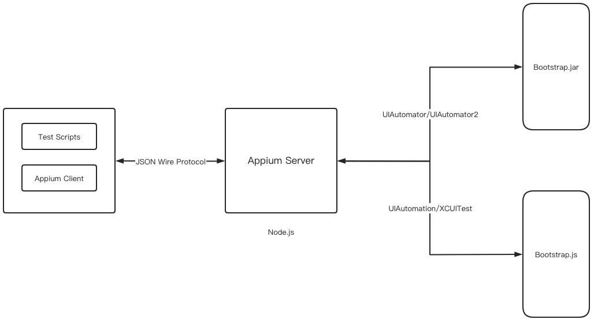
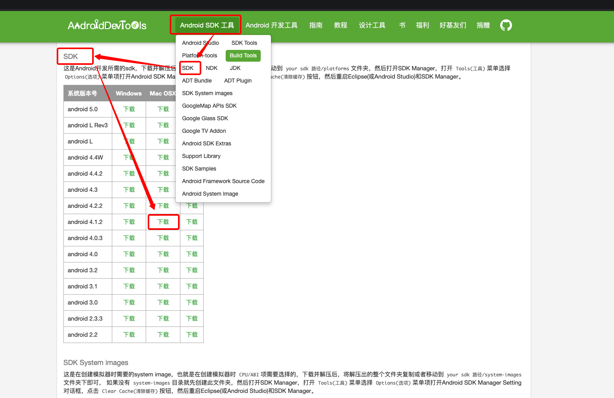
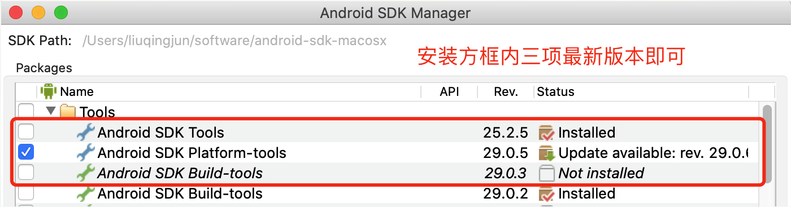
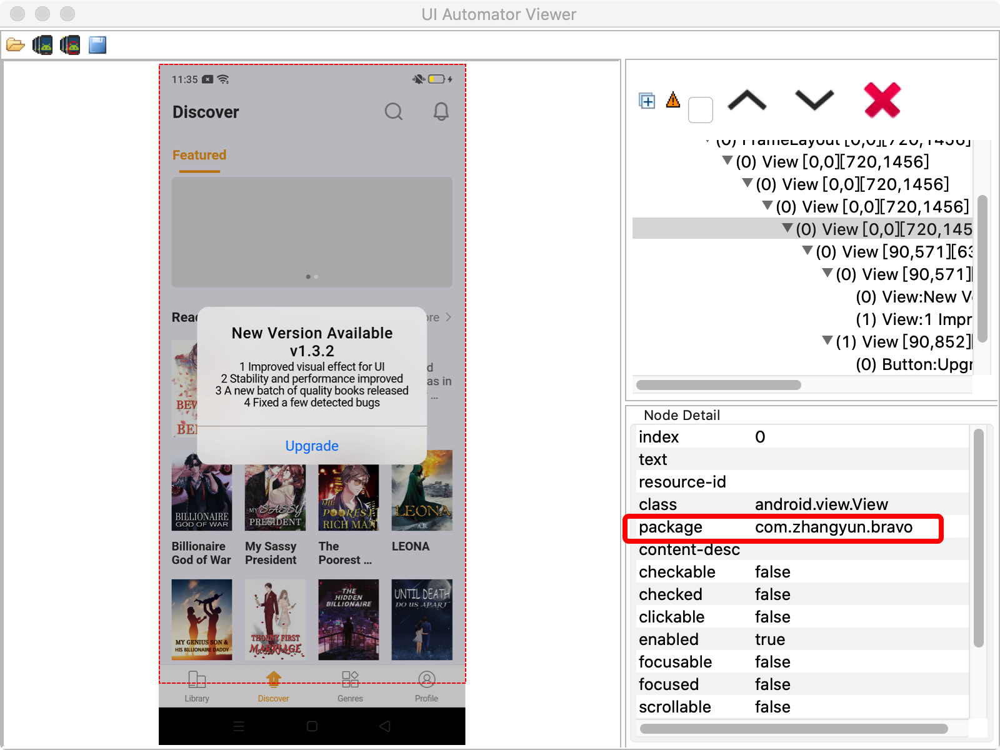
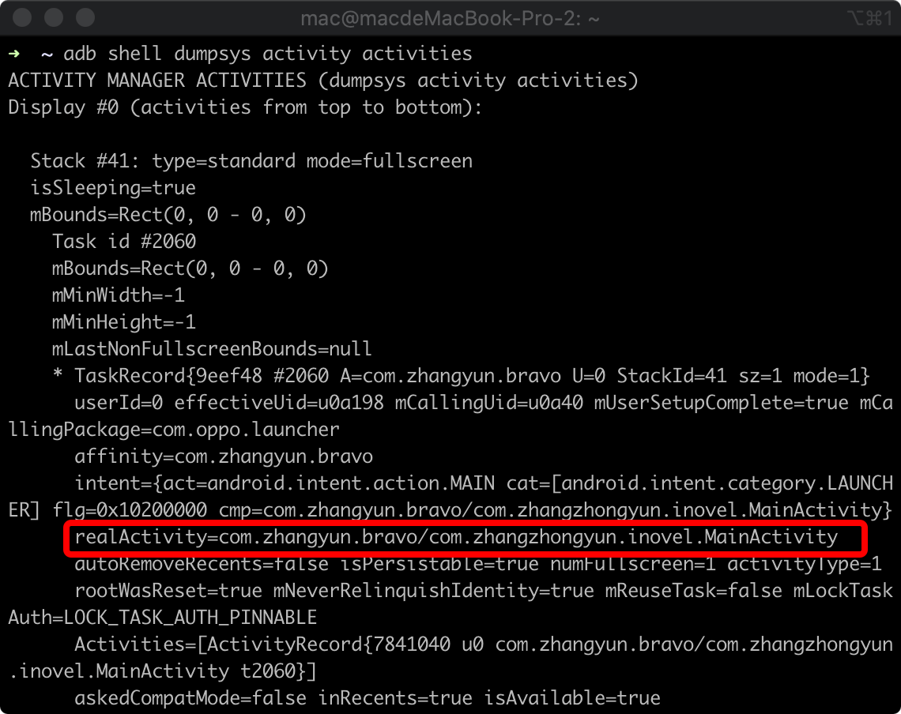

# Appium基础

## 一. Appium简介

Appium 是一个开源工具，用于自动化 iOS 手机、 Android 手机和 Windows 桌面平台上的原生、移动 Web 和混合应用。Appium 支持 iOS 上的 Safari 、Chrome 和 Android 上的内置浏览器。重要的是，Appium 是跨平台的：它允许你用同样的 API 对多平台（iOS、Android、Windows）写测试。做到在 iOS、Android 和 Windows 测试套件之间复用代码。[教程](http://appium.io/docs/cn/about-appium/intro/)

## 二. Appium架构原理

Appium的架构原理如图6-2所示，由客户端（Appium Client）和服务器（AppiumServer）两部分组成，客户端与服务器端通过JSON Wire Protocol进行通信。



1. Appium服务器：Appium服务器是Appium框架的核心。它是一个基于Node.js实现的HTTP服务器。Appium服务器的主要功能是接受从Appium客户端发起的连接，监听从客户端发送来的命令，将命令发送给bootstrap.jar（iOS手机为bootstrap.js）执行，并将命令的执行结果通过HTTP应答反馈给Appium客户端。
2. Bootstrap.jar：Bootstrap.jar是在Android手机上运行的一个应用程序，它在手机上扮演TCP服务器的角色。当Appium服务器需要运行命令时，Appium服务器会与Bootstrap. jar建立TCP通信，并把命令发送给Bootstrap.jar; Bootstrap.jar负责运行测试命令。
3. Appium客户端：它主要是指实现了Appium功能的WebDriver协议的客户端Library，它负责与Appium服务器建立连接，并将测试脚本的指令发送到Appium服务器。现有的客户端Library有多种语言的实现，包括Ruby、Python、Java、JavaScript（Node. js）、Object C、PHP和C#。Appium的测试是在这些Library的基础上进行开发的。
4. Session：Appium的客户端和服务端之间进行通信都必须在一个Session的上下文中进行。客户端在发起通信的时候首先会发送一个叫作「预期能力（Desired Capabilities）」的JSON对象给服务器。服务器收到该数据后，会创建一个session并将session的ID返回到客户端。之后客户端可以用该session的ID发送后续的命令。
5. Desired Capabilities：Desired Capabilities是一组设置的键值对的集合，其中键对应设置的名称，而值对应设置的值。Desired Capabilities主要用于通知Appium服务器建立需要的Session，其中一些设置可以在Appium运行过程中改变Appium服务器的运行行为。
6. Appium Desktop：这有一个 Appium 服务器的图形界面封装可以下载，它适用于任何平台。它打包了 Appium 服务器运行需要的所有东西，所以你不需要为 Node 而烦恼。它们还提供一个 Inspector 使你可以查看应用程序的层级结构。这在写测试时可以派上用场。

Appium在Android上基于UIAutomator实现了测试的代理程序（Bootstrap.jar），在iOS上基于UIAutomation实现了测试的代理程序（Bootstrap.js）。当测试脚本运行时，每行WebDriver的脚本都将转换成Appium的指令发送给Appium服务器，而Appium服务器将测试指令交给代理程序，将由代理程序负责执行测试。比如脚本上的一个点击操作，在Appium服务器上都是touch指令，当指令发送到Android系统上时，Android系统上的Bootstrap.jar将调用UIAutomator的方法实现点击操作；而当指令发送到iOS系统上时，iOS的Bootstrap.js将调用UIAutomation的方法实现点击操作。由于Appium有了这样的能力，同样的测试脚本可以实现跨平台运行。

## 三. Appium环境搭建

安装Appium有两种方式，一种是通过npm安装appium的服务端，一种是通过Appium Desktop，下列是通过Appium Desktop

### 3.1 MAC平台基于Python的Appium环境搭建

__3.1.1 mac下搭建jdk__

1. 去官网下载并按平时的方法双击dmg文件，根据提示安装完成–[oracle 官网下载地址](https://www.oracle.com/cn/java/technologies/javase-jdk13-downloads.html)


2. 设置Java的环境变量

* 步骤一：打开mac终端命令行工具，输入 “/usr/libexec/java_home -V” ，查找java安装路径，如下图：


* 步骤二：复制java安装路径后，然后打开终端输入“ls -an”，查看“.bash_profile”文件是否存在，如果不存在，输入“touch .bash_profile”，如果存在就跳过这一步，直接输入 “open -e .bash_profile” ，在该文件下新增

```java
export JAVA_HOME=/Library/Java/JavaVirtualMachines/jdk1.8.0_40.jdk/Contents/Home
export PATH=$JAVA_HOME/bin:$PATH:.
export CLASSPATH=$JAVA_HOME/lib/tools.jar:$JAVA_HOME/lib/dt.jar
```
* 步骤三：保存文件之后，输入命令 “source ~/.bash_profile” ，让环境变量生效。
* 步骤四：依次输入命令 “java -version” 和 “javac” 执行，检查 jdk是否安装成功。（不提示command not found 即安装成功）

__3.1.2  mac下搭建android-sdk__

* 步骤一：去官网下载，下载后解压到某个文件夹下–[Android SDK下载地址](https://www.androiddevtools.cn/)



* 步骤二：解压后的文件夹下面找到tools，点击下面的android，打开Android SDK Manager。选择你想要下载的安装包，点击“install”下载安装。



* 步骤三：复制android jdk安装路径后，然后打开终端输入“ls -an”，查看“.bash_profile”文件是否存在，如果不存在，输入“touch .bash_profile”，如果存在就跳过这一步，直接输入 “open -e .bash_profile” ，在该文件下新增

```java
export ANDROID_HOME=/Users/zhazha/Downloads/android-sdk-macosx
export PATH=$PATH:$ANDROID_HOME/tools
export PATH=$PATH:$ANDROID_HOME/platform-tools
```
* 步骤四：保存文件之后，输入命令 “source ~/.bash_profile” ，让环境变量生效。
* 步骤五：依次输入命令 “adb” “android -v” “aapt” 执行，检查 jdk是否安装成功。

__3.1.3 mac安装homebrew / nodejs / appium客户端__

```shell
# 安装brew
ruby -e "$(curl -fsSL https://raw.github.com/mxcl/homebrew/go)"
# 安装python3及相关包，这步是安装appium的客户端
brew install python3
pip install selenium
pip install appium-python-client
# 安装nodejs
brew install nodejs
# 配置cnpm
npm install -g cnpm --registry=https://registry.npm.taobao.org
# 安装appium（即安装appium的服务端），因为我安装了桌面版所以不安装Appium-Server了
# sudo cnpm install appium -g
```
__3.1.4 mac安装Appium桌面版__

[appium desktop下载地址](https://github.com/appium/appium-desktop/releases/)下载好Appium-mac-1.15.1.dmg后，直接双击根据提示安装即可。

__3.1.5 验证安装__

要验证是否满足Appium的所有依赖关系，可以使用 appium-doctor。使用进行安装`sudo cnpm install appium-doctor -g`，然后运行 appium-doctor命令，提供--ios或--android标志以验证是否正确设置了所有依赖项。可能有一些依赖要自己安装，可以参考[解决appium-doctor依赖问题](https://www.cnblogs.com/wuduoduo41/archive/2004/01/13/12411197.html)[opencv4nodejs安装](https://github.com/justadudewhohacks/opencv4nodejs)

### 3.2 Windows平台基于Python的Appium环境搭建

[Appium环境搭建](https://www.cnblogs.com/superhin/p/11454786.html)

## 二. 连接Android系统

### 2.1 将Appium与Android进行通信连接

这段代码比较固定

```python
from appium import webdriver

# 设置Android系统信息,变量desired_caps是一个字典，字典的key是代表Appium与Android系统的连接参数，字典的value是Android系统信息。
desired_caps = {}

# 需要被连接的操作系统，如iOS、Android或FirefoxOS。
desired_caps['platformName'] = 'Android'
# Android系统的当前版本信息，如本机的手机系统为9.0。
desired_caps['platformVersion'] = '9.0'
# 需要执行自动化的Android应用的包名。
desired_caps['appPackage'] = 'com.zhangyun.bravo'
# Android应用包中启动的Android Activity名称。
desired_caps['appActivity'] = 'com.zhangzhongyun.inovel.MainActivity'
# 每台移动设备或模拟器的设备名，设备名是唯一的。
desired_caps['deviceName'] = 'dd7a223e'

#启动服务器地址，后面跟的是手机信息
dirver = webdriver.Remote('http://0.0.0.0:4723/wd/hub', desired_caps)
```

#### 2.1.1 获取移动设备的设备名的方法

1. 打开Android SDK所在的文件夹，找到tools文件夹里的uiautomatorviewer.bat文件并双击运行，该文件启动一个名为UI Automator Viewer的软件。


2. 在Android SDK的文件路径中找到AVD Manager.exe并双击运行，该exe程序可以启动Android模拟器。
3. 将手机连接到计算机，连接之前确保手机已开启USB调试模式，连接成功后，手机界面会出现一个USB调试提示信息，单击“确定”按钮即可。


4. 在UI Automator Viewer的软件中，获取设置的设备名


#### 2.1.2 获取appPackage的方法

参数appPackage同样需要借助工具UI Automator Viewer获取，选中获取设备名的按钮，并且保持手机屏幕常亮，单击“OK”按钮，软件就会自动捕捉手机当前界面的控件信息。单击手机上的某个控件，该控件信息就会显示在右侧。其中参数package的参数值就是参数appPackage的参数值。



#### 2.1.3 获取appActivity的方法

打开CMD窗口并输入adb shell dumpsys activity activities指令来获取当前设备的程序运行信息。在这些信息中可以找出appActivity的参数值，比如查找bravonovel的AppActivity，com.zhangyun.bravo/com.zhangzhongyun.inovel.MainActivity，斜杠后面的内容com.zhangzhongyun.inovel.MainActivity就是参数appActivity的参数值。



#### 2.1.4 Appium连接移动设备或模拟器的常用参数

参考这个文档[文档](http://appium.io/docs/cn/writing-running-appium/caps/)

https://www.cnblogs.com/du-hong/p/11003755.html
