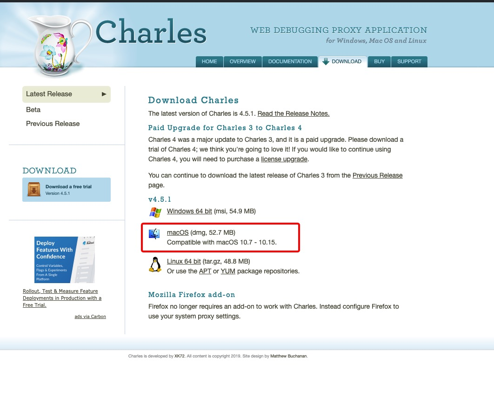
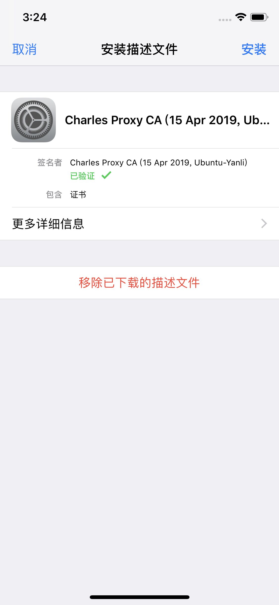
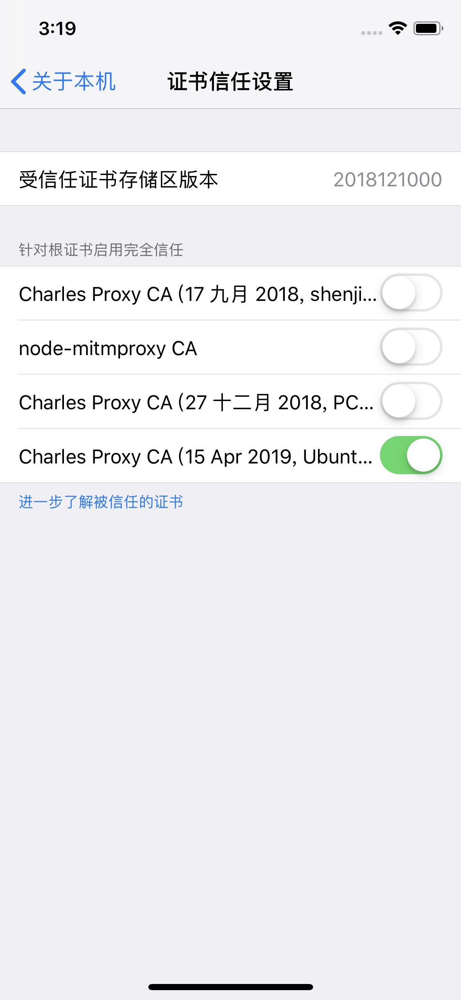
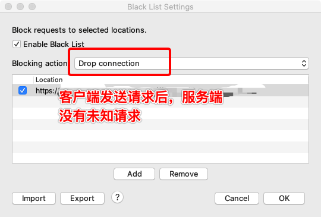
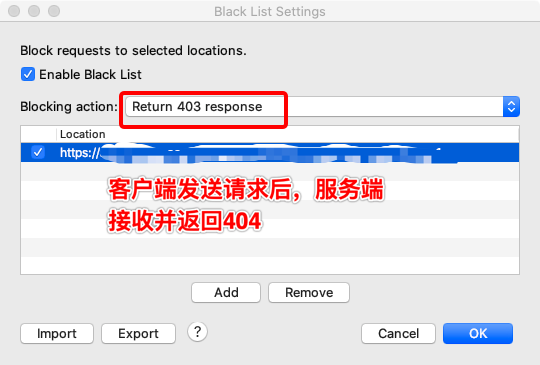
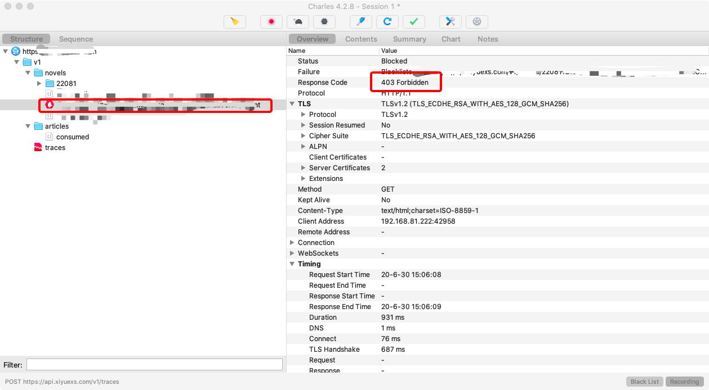
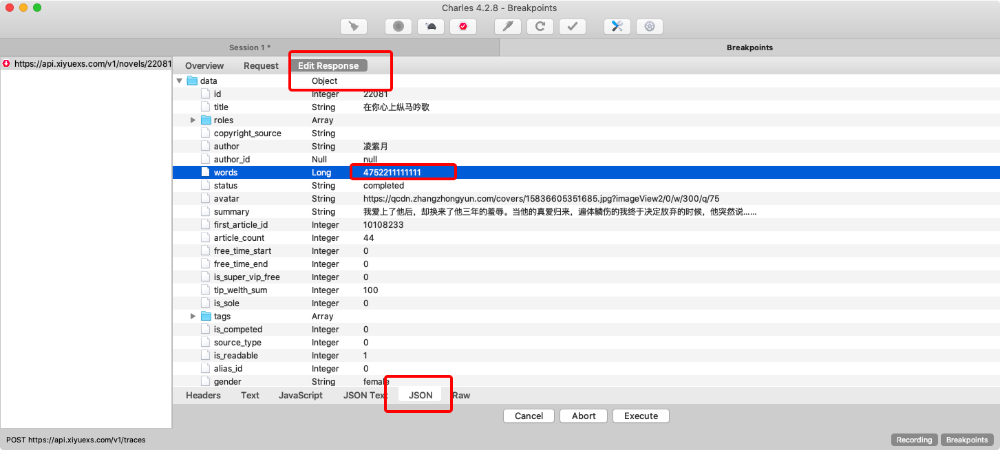

# Charles 抓包

## 简介

Charles是一款代理服务器，通过成功电脑或者浏览器的代理，然后截取请求和请求结果分析数据的目的。

在测试过程中，__经常使用该抓包工具达到以下目的__：

1. 获取数据分析缺陷的来源
2. __模拟网络请求__：可选择已有的网络速度，也可手动编辑网速
3. 模拟request请求数据、模拟response响应数据
4. 黑名单：模拟请求超时、模拟请求返回404等

## mscOS下载安装 Charles

1. Charles官网下载安装包，下载成功后根据提示安装即可。
[官方网站](https://www.charlesproxy.com/download/)

2. 激活Charles

Charles激活码:

Registered Name: https://zhile.io

License Key: 48891cf209c6d32bf4

激活步骤：
打开Charles，help->Registered to xclient - Multi-Site License，输入账号和key提交破解成功就可以使用了

## HTTP代理设置

1. 设置PC端代理端口号
在Proxy——>Proxying Settings——>点击add——>在弹出的对话框里面设置端口号：8888（也可更改，手机设置代理输入一致即可）,最后如图所示：

## HTTPS代理配置

1. 配置SSL访问
在Proxy——>SSL Proxying Settings——>点击add——>在弹出的对话框里面设置主机host:*和端口号post:443——>勾选Enable SSL Proxying,最后如图所示：

## iOS使用步骤

1. 打开charles后，要安装SSL证书：help——>SSL proxying——>Install Charles Root Certificate On a Mobile Device or Remote Browser，最后出现如图所示弹框：

2. iOS端手机可根据第二步的弹窗更改手机端的设置：即点开wifi旁边的感叹号——>点击配置代理——>选择手动——>填入服务器号，即本机IP地址，端口号：8888（一般默认8888）——>点击存储——>再在safari浏览器网址栏输chls.pro/ssl——>点击安装，最后证书状态显示已验证如图所示：

3. 继续iOS手机端设置：通用——>关于本机——>证书信任设置——>选择信任刚刚下载的SSL证书，最后如图所示：

[注]：手机和电脑必须处在同一个局域网内，也就是必须连接同一个wife

## Android使用步骤

1. 打开charles后，要安装SSL证书：help——>SSL proxying——>Install Charles Root Certificate On a Mobile Device or Remote Browser，最后出现如图所示弹框：

2. 设置-WLAN，进入已连接WiFi手动设置（端口需与PC端设置端口号一致）

[注]不同安卓手机弹出设置代理入口不同，如果进入网络详情页无代理项，可在WLAN列表长按wifi名称弹出代理设置

3. 在浏览器网址栏输chls.pro/ssl——>证书下载成功后，进入设置-更多设置-系统安全-从存储的设备安装页面，查看已下载的证书，选择证书安装，输入证书名称，证书命名可随意填写，确定后安装成功！如图所示：

[注]：手机和电脑必须处在同一个局域网内，也就是必须连接同一个wife

## 设置黑名单

1. 选择需要加入黑名单的请求，鼠标点击右键--选择black list即添加成功

2. 查看和修改已加入黑名单的请求：菜单路径tools-black list；一般测试过程中用来模拟请求超时(Drop conneciton)或者返回403(Return 403 response)

[注]：双击请求，将query删除

当黑名单添加成功后，对其进行抓取，如图

将黑名单去除后，对其进行抓取，为200，如图

## 设置断点

设置断点，可以修改请求的request数据，也可以修改response响应数据。

目前使用fiddler发现设置断点，该工具有的返回格式不是json，导致客户端不会展示。使用Charles工具，可以避免该问题，具体操作如下

1. 对要打断点的接口右键，选择「Breakpoints」，添加到断点列表后，进入proxy-Breakpoints settings(手动编辑断点内容)设置断点的类型

断点类型分为：request断点、response断点

2. 双击Location中的想要打断点的接口，弹出Edit Breakpoints

3. 将Query中的内容删除，输入*

如果修改Request数据，就将Request勾选

如果修改Response数据，就将Response勾选

4. 此时重新访问该接口，Charles自动跳转到Breakpoints页面

5. 此时修改Response数据，点击Edit Response，切换底部tab至JSON，修改所需要的数据

6. 修改数据后，点击Execute，查看访问的页面，数据将会显示已修改的Response数据

7. 自动将指定的响应(response)数据改为固定返回值

1）选择该网络请求->鼠标右键Save Response...

2）如果该请求返回一个json串，保存文件时需要保存21006.json

3）需要更改请求，点击右键Map Local...指定到本地保存的21006.json

4）通过在本地更改21006.json就可以自动更改请求的返回值。避免每次使用时修改breakpoints中的返回值，提高效率

8. 自动将制定的请求(request)数据改为固定返回值

1）选择该网络请求->鼠标右键Map Remove...，请求添加成功后

2）将编辑好的响应数据填充在编辑框的下半部分，如下图

按上诉操作成功后，再次发起该请求，会自动使用已设置好的请求数据

## 设置网速

菜单路径：proxy-throttle settings ，勾选enable throttling 启动限速

根据以上设置成功后，接下来测试过程中发起的请求都会在该网络下运行。该功能主要用在模拟不同网速下的请求场景，例如：模拟弱网请求

## 压测/重复发送请求

菜单路径：tools-Advanced Repeat...，也可以在控制台上选择某个请求，然后鼠标右键打开菜单，选择Repeat advance...，打开Repeat advance的设置窗口如下：

1. Iterations：重复次数
2. Consurrency：并发
3. Repeat delay(ms)：重复延迟间隔

设置重复参数后，点击OK会打开新的session进行压力测试，压力测试结果如下

